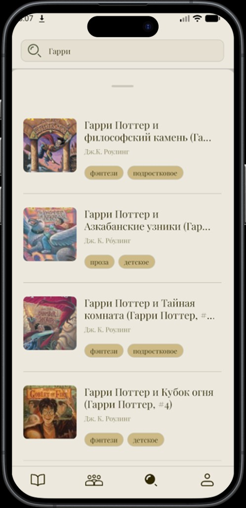
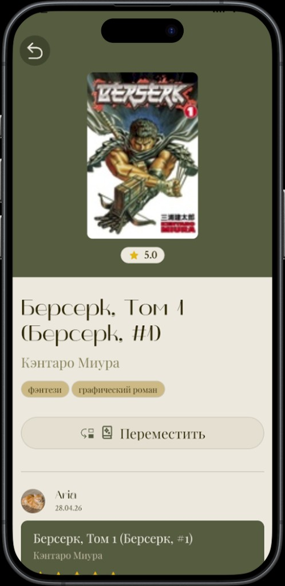
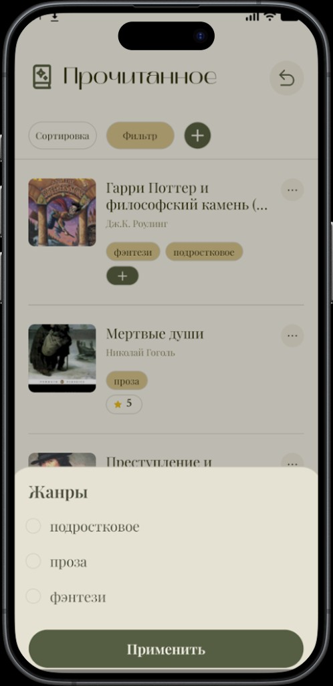
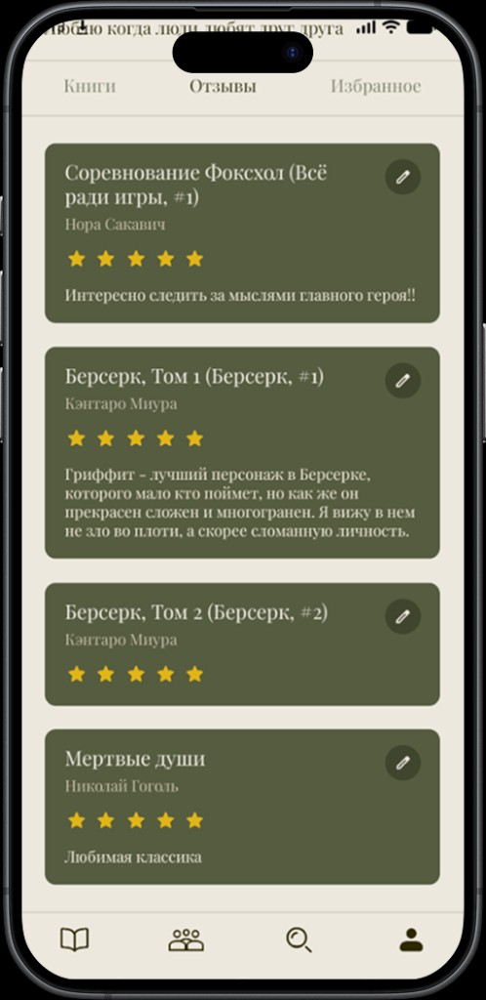
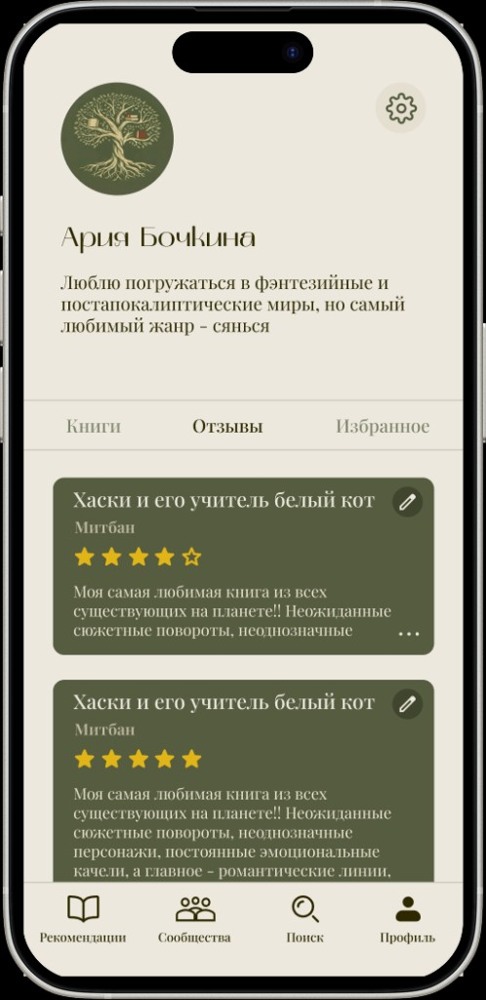
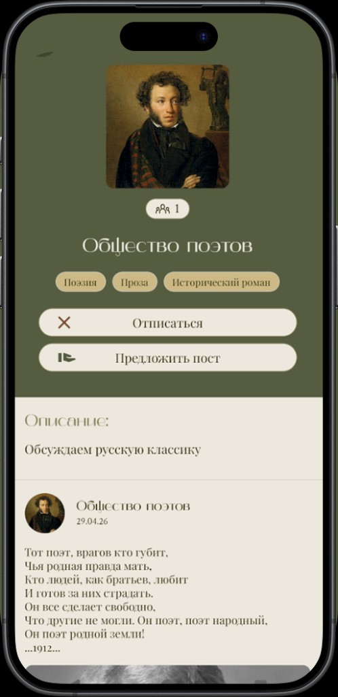
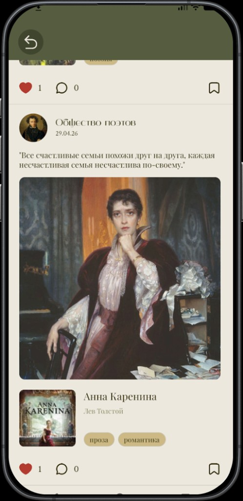
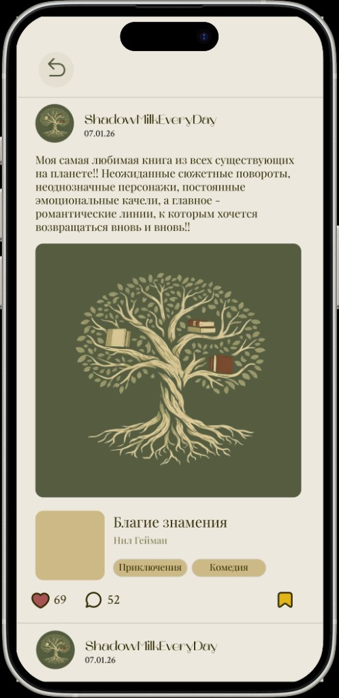
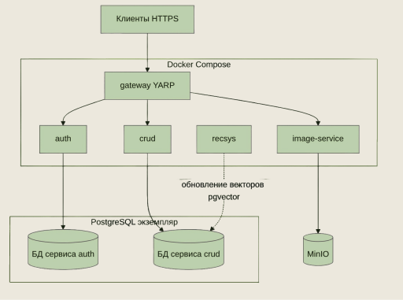
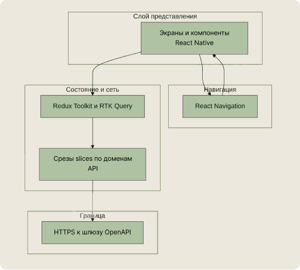

<p align="center">
  
</p>

<h1 align="center">Selectio</h1>

<p align="center">
  <strong>Социальная сеть для любителей книг с рекомендательной системой</strong><br/>
  <em>Social network for bookworms with a recommendation system</em>
</p>

<p align="center">
  Кроссплатформенное мобильное приложение · микросервисный backend · персональные рекомендации
</p>

<p align="center">
  <a href="https://www.figma.com/slides/YJc9tYFzIqMYBHni7pKELg/Untitled?node-id=4-22">Презентация</a>
  ·
  <a href="https://www.figma.com/design/gTrgowE1sgzEVJ8jRgGcSw/Дизайн?node-id=0-1">Дизайн в Figma</a>
</p>

<p align="center">
  
  
  
  
  
</p>

---

## О проекте

**Selectio** — мобильная платформа, где можно находить книги, вести личную библиотеку, общаться в тематических сообществах и получать персональные рекомендации книг и постов.

Идея простая: соединить привычный «книжный трекер» с социальной лентой и умным подбором контента — чтобы открывать не только новые книги, но и людей, которым они тоже важны.

| | |
| --- | --- |
| **Платформы** | iOS и Android (React Native + Expo) |
| **Сервер** | микросервисы на ASP.NET Core, PostgreSQL, MinIO, Docker |
| **Рекомендации** | ALS → векторные эмбеддинги + поиск ближайших соседей (pgvector) |
| **Год** | 2025–2026 |

---

## Скриншоты

<p align="center">
  
  
  
  
</p>
<p align="center">
  
  
  
  
</p>
<p align="center">
  
  
</p>

---

## Возможности

### Базовые сценарии
- регистрация и вход по email, подтверждение почты
- просмотр и редактирование профиля, загрузка аватара

### Книжные сценарии
- каталог, поиск и просмотр книг
- отзывы и оценки
- личная библиотека со статусами **«Хочу прочитать»**, **«В процессе»**, **«Прочитанное»**

### Социальные сценарии
- сообщества: создание, вступление, ленты
- посты, комментарии, лайки и избранное
- публикация от имени своего сообщества или предложение поста в чужое (с модерацией)

### Рекомендации
- персональная лента книг и постов
- подбор на основе истории взаимодействий пользователя

---

## Архитектура

### Общая схема

```text
┌─────────────────────┐
│  Mobile client      │
│  React Native/Expo  │
└──────────┬──────────┘
           │ HTTPS
           ▼
┌─────────────────────┐
│      GATEWAY        │  маршрутизация, CORS, проверка JWT
└──┬──────┬───────┬───┘
   │      │       │
   ▼      ▼       ▼
 AUTH   CRUD   IMAGE-SERVICE
   │      │       │
   │      │       ▼
   │      │     MinIO (S3)
   │      ▼
   │   PostgreSQL + pgvector
   │      ▲
   │      │ embeddings
   │   RECSYS (ALS)
   ▼
  Auth DB
```

### Backend

<p align="center">
  
</p>

| Сервис | Роль |
| --- | --- |
| **Gateway (YARP)** | единая точка входа, маршрутизация, CORS, JWT для защищённых маршрутов |
| **Auth** | регистрация, вход, аутентификация; пароли в хешированном виде |
| **CRUD** | книги, библиотеки, профили, сообщества, посты, комментарии, лайки, рекомендации, избранное, модерация |
| **Image-service** | загрузка и выдача медиа; файлы в MinIO (S3-совместимое хранилище) |
| **Recsys** | расчёт рекомендаций и обновление векторов pgvector для персонализации |

### Frontend

<p align="center">
  
</p>

Мобильное приложение отвечает за навигацию, отображение данных, действия пользователя, состояния загрузки и ошибки сети.

- **UI:** React Native + Expo  
- **Состояние и API:** Redux Toolkit + RTK Query  
- **Секреты:** `expo-secure-store` (JWT)  
- **Медиа:** `expo-image-picker`  
- **Навигация:** React Navigation  

Дизайн и функциональный прототип собраны в Figma, затем перенесены в код.

---

## Стек технологий

<details>
<summary><strong>Frontend</strong></summary>

- JavaScript, React, React Native, Expo
- Redux Toolkit, RTK Query, React Redux
- React Navigation
- Expo Secure Store, Expo Image Picker, Expo Font
- шрифты: Playfair Display, Crimson Text / Mak (в макете)

</details>

<details>
<summary><strong>Backend</strong></summary>

- ASP.NET Core (.NET 9), EF Core
- PostgreSQL + **pgvector** (HNSW, cosine distance)
- MinIO
- Docker / Docker Compose
- Python-пайплайн рекомендаций (ALS)

</details>

---

## Рекомендательная система

Для построения эмбеддингов сравнивались ALS, усечённый SVD и нейросетевые подходы (NCF, LightGCN). По совокупности критериев (качество, ресурсы на обучение, интерпретируемость, согласование с метрикой близости) для наших требований наиболее разумным оказался **ALS**.

Готовые векторы загружаются в CRUD-сервис и используются при выдаче персонализированных книг и постов через приближённый поиск соседей в PostgreSQL.

---

## Структура репозитория

```text
Selectio/
├── frontend/          # мобильный клиент (Expo / React Native)
│   └── app/
├── backend/           # микросервисы и инфраструктура
│   ├── gateway/
│   ├── auth/
│   ├── crud/
│   ├── image-service/
│   ├── recsys/
│   └── docker-compose.yml
└── README.md
```

Подробнее про API и локальный запуск сервера — в [`backend/README.md`](backend/README.md).  
План экранов и интеграции клиента — в [`frontend/screens.md`](frontend/screens.md).

---

## Быстрый старт

### Backend

```bash
cd backend
cp .env.template .env   # заполните JWT_SECRET_KEY и GATEWAY_INTERNAL_TOKEN
docker compose up --build
```

| Сервис | URL |
| --- | --- |
| API Gateway | `http://localhost:8000` |
| OpenAPI (Development) | `http://localhost:8000/docs/all/openapi.json` |
| Auth (напрямую) | `http://localhost:8080` |
| CRUD (напрямую) | `http://localhost:8090` |

### Frontend

```bash
cd frontend/app
npm install
npx expo start
```

По умолчанию клиент ходит на прод-шлюз (`https://selectio-book.ru`). Для локальной разработки измените `baseUrl` в `frontend/app/config/api.js` на `http://localhost:8000` (или IP вашей машины для устройства/эмулятора).

---

## Команда

| Участник | Роль |
| --- | --- |
| **Анна Рябочкина** | frontend-разработчик |
| **Артём Ермошкин** | backend-разработчик |

---

## Результаты

- рабочее кроссплатформенное мобильное приложение социальной сети для книголюбов
- микросервисный backend со всеми ключевыми сценариями
- рекомендательный контур на базе ALS и векторного поиска
- цельный UX/UI и продуманная интеграция клиента с API

### Что дальше

1. оптимизация размера и скорости приложения  
2. более точные модели рекомендаций  
3. веб-версия  
4. расширение функционала (например, чтение книг внутри приложения)

---

## Ссылки

- [Презентация проекта](https://www.figma.com/slides/YJc9tYFzIqMYBHni7pKELg/Untitled?node-id=4-22)
- [Дизайн в Figma](https://www.figma.com/design/gTrgowE1sgzEVJ8jRgGcSw/Дизайн?node-id=0-1)

---

<p align="center">
  <em>Читайте с удовольствием вместе с Selectio</em>
</p>
